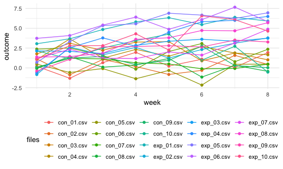

Homework5
================
Jyoti Kumar

``` r
library(tidyverse)
```

    ## ── Attaching packages ──────────────────────────────────────────────────────────────────────── tidyverse 1.3.0 ──

    ## ✓ ggplot2 3.3.2     ✓ purrr   0.3.4
    ## ✓ tibble  3.0.3     ✓ dplyr   1.0.2
    ## ✓ tidyr   1.1.2     ✓ stringr 1.4.0
    ## ✓ readr   1.3.1     ✓ forcats 0.5.0

    ## ── Conflicts ─────────────────────────────────────────────────────────────────────────── tidyverse_conflicts() ──
    ## x dplyr::filter() masks stats::filter()
    ## x dplyr::lag()    masks stats::lag()

``` r
library(rvest)
```

    ## Loading required package: xml2

    ## 
    ## Attaching package: 'rvest'

    ## The following object is masked from 'package:purrr':
    ## 
    ##     pluck

    ## The following object is masked from 'package:readr':
    ## 
    ##     guess_encoding

``` r
knitr::opts_chunk$set(
  fig.width = 6,
  fig.asp = 0.6,
  out.width = "90%"
)

theme_set(theme_minimal() + theme(legend.position = "bottom"))

options(
  ggplot2.continuous.colour = "viridis",
  ggplot2.continuous.fill = "viridis"
)

scale_color_discrete = scale_colour_viridis_d
scale_fill_discrete = scale_fill_viridis_d
```

# Problem1

The Raw Data gives us information on the homicide cases in 50 large US
cities. The Data gives us information on the date reported, victims
name, race, age and sex. It provides us with the city, the latitude and
longitude information and the disposition of the case.

``` r
homicide_df = 
  read_csv("data/homicide-data.csv") %>% 
  mutate(
    city_state = str_c(city, state, sep = "_"),
    resolved = case_when(
      disposition == "Closed without arrest" ~ "Unsolved",
      disposition == "Open/No arrest"        ~ "Unsolved",
      disposition == "Closed by arrest"      ~ "solved"
    )
  ) %>%
  select(city_state, resolved) %>% 
  filter(city_state != "Tulsa_AL")
```

    ## Parsed with column specification:
    ## cols(
    ##   uid = col_character(),
    ##   reported_date = col_double(),
    ##   victim_last = col_character(),
    ##   victim_first = col_character(),
    ##   victim_race = col_character(),
    ##   victim_age = col_character(),
    ##   victim_sex = col_character(),
    ##   city = col_character(),
    ##   state = col_character(),
    ##   lat = col_double(),
    ##   lon = col_double(),
    ##   disposition = col_character()
    ## )

``` r
aggregate_df =
  homicide_df %>% 
  group_by(city_state) %>% 
  summarize(
    hom_total = n(),
    hom_unsolved = sum(resolved != "solved")
  )
```

    ## `summarise()` ungrouping output (override with `.groups` argument)

``` r
prop.test(
  aggregate_df %>% filter(city_state == "Baltimore_MD") %>% pull(hom_unsolved),
  aggregate_df %>% filter(city_state == "Baltimore_MD") %>% pull(hom_total)) %>% 
  broom::tidy()
```

    ## # A tibble: 1 x 8
    ##   estimate statistic  p.value parameter conf.low conf.high method    alternative
    ##      <dbl>     <dbl>    <dbl>     <int>    <dbl>     <dbl> <chr>     <chr>      
    ## 1    0.646      239. 6.46e-54         1    0.628     0.663 1-sample… two.sided

``` r
results_df =
aggregate_df %>%
  mutate(
    prop_tests = map2(.x = hom_unsolved, .y = hom_total, ~prop.test(x = .x, n = .y)),
    tidy_tests = map(.x = prop_tests, ~broom::tidy(.x))
  ) %>% 
  select(-prop_tests) %>% 
  unnest(tidy_tests) %>% 
  select(city_state, estimate, conf.low, conf.high )
```

``` r
results_df %>%
  mutate(city_state = fct_reorder(city_state, estimate)) %>% 
  ggplot(aes(x = city_state, y = estimate)) +
  geom_point() +
  geom_errorbar(aes(ymin = conf.low, ymax = conf.high)) +
  theme(axis.text.x = element_text(angle = 90, vjust = 0.5, hjust = 1))
```


# Problem2

``` r
data1 = read.csv("data/problem2data/con_01.csv")
```

``` r
path_df =
  tibble(
    files = list.files("data/problem2data"),
    path = str_c("data/problem2data/", files)) %>% 
      mutate(data = map(path, read_csv, col_types = "dddddddd")) %>% 
  unnest()
```

    ## Warning: `cols` is now required when using unnest().
    ## Please use `cols = c(data)`

``` r
path_df %>% 
  pivot_longer(week_1:week_8, names_to = "week", values_to = "outcome", names_prefix = "week_") %>% 
  mutate(
    week = as.numeric(week)
  ) %>% 
ggplot(aes(x = week, y = outcome, color = files)) + geom_point() + geom_path()
```



While no major trend can be clearly seen, It can be noted that the
experimental groups have a higher outcome compared to the control
groups. It can also be noted that Controls 4, 5, and 6 are at the lower
end while experimental groups 4, 5, and 6 are at the upper end of the
chart.

# Problem3

``` r
sim_t_test = function(n_samp = 30, mu = 2, sigma = 5) {
 
  sim_data = tibble(
    x = rnorm(n_samp, mean = mu, sd = sigma)
  )
 
  test = t.test(x ~ 1, data = sim_data)
 
  broom::tidy(test)
  
}
```

``` r
sim_results = 
  tibble(mu = 0:6) %>% 
      mutate(
        output_lists = map(.x = mu, ~rerun(5000, sim_t_test(n = 30, mu = .x))),
        estimate_dfs = map(output_lists, bind_rows)
               ) %>%
  select(-output_lists) %>% 
  unnest()
```

    ## Warning: `cols` is now required when using unnest().
    ## Please use `cols = c(estimate_dfs)`

``` r
sim_results %>% 
  mutate(
    pvalue = p.value)
```

    ## # A tibble: 35,000 x 10
    ##       mu estimate statistic p.value parameter conf.low conf.high method
    ##    <int>    <dbl>     <dbl>   <dbl>     <dbl>    <dbl>     <dbl> <chr> 
    ##  1     0   0.935     0.939   0.356         29   -1.10      2.97  One S…
    ##  2     0  -0.0465   -0.0554  0.956         29   -1.76      1.67  One S…
    ##  3     0  -0.450    -0.473   0.640         29   -2.39      1.49  One S…
    ##  4     0  -1.58     -1.82    0.0786        29   -3.36      0.192 One S…
    ##  5     0   0.271     0.220   0.828         29   -2.25      2.80  One S…
    ##  6     0   0.263     0.308   0.760         29   -1.48      2.01  One S…
    ##  7     0   0.428     0.452   0.655         29   -1.51      2.37  One S…
    ##  8     0   1.06      1.20    0.240         29   -0.748     2.87  One S…
    ##  9     0  -0.704    -0.731   0.470         29   -2.67      1.27  One S…
    ## 10     0   0.819     1.37    0.181         29   -0.404     2.04  One S…
    ## # … with 34,990 more rows, and 2 more variables: alternative <chr>,
    ## #   pvalue <dbl>
